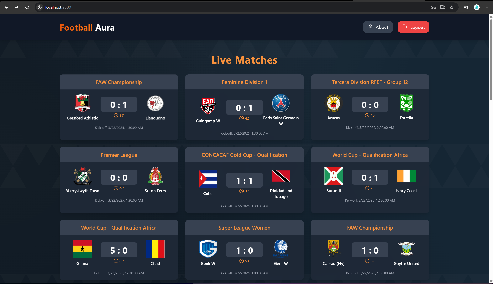
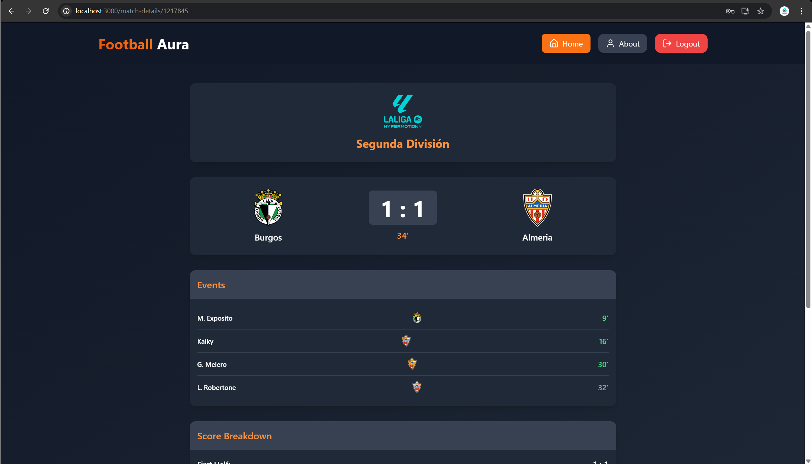

# Football Aura

Football Aura is a real-time football web application that provides live match updates, video highlights, player statistics, and league standings — all in one place.

## 🔧 Tech Stack

- **Frontend:** React.js, Tailwind CSS, Framer Motion
- **Backend:** Node.js, Express.js
- **Database:** MongoDB
- **APIs:** API-FOOTBALL, YouTube Data API
- **Authentication:** JWT, bcrypt.js

## 🚀 Features

- Live football match updates with scores, teams, and events
- Auto-fetched video highlights from YouTube
- Premier League standings table
- Match details with events, venue, referee, and time breakdown
- User authentication (sign up / login)
- Fully responsive and styled using Tailwind CSS

## 🖼️ Screenshots

### Live Matches

### Match Details

### Match Highlights

### Standings

### Login / Signup Page

